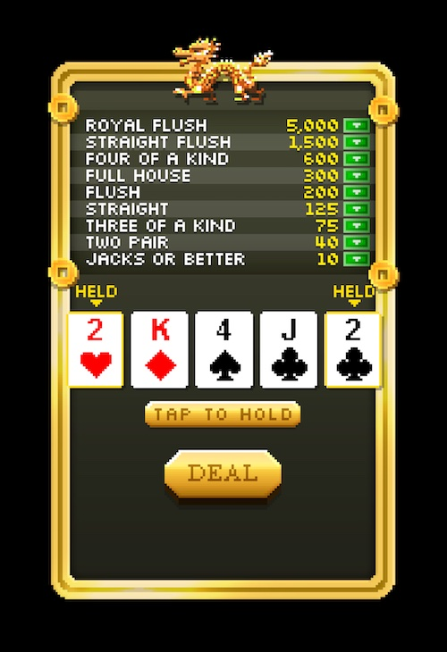

# 5-Card Draw Poker Simulator
This is a program designed to simulate probabilities for [5-card draw poker](https://en.wikipedia.org/wiki/Five-card_draw), inspired by the poker minigame in [Tiny Tower Vegas](https://apps.apple.com/us/app/tiny-tower-vegas/id871899103).



## Installation

```bash
git clone https://github.com/kenzheng99/poker-simulator.git
cd poker-simulator
```

## Example Usage
### simulate.py: simulate a known hand to find the optimal replacement
- Input: 5 cards in the format `As`, where `23456789TJQKA` are the possible ranks and `d` (diamonds) `c` (clubs) `h` (hearts) `s` (spades) are the possible suits.
- Optional Parameters:
    - `-i`, `--num_iters` the number of simulation iterations to run per replacement combination (default 10000)
    - `-v`, `--verbose` verbose mode, outputs detailed statistics for hand values in all replacement cases
- Output: result table with all possible combinations of cards to hold, and the expected value (ev) of winnings in bux based on the Tiny Tower scoring table.
```
your-mbp poker-simulator % python3 simulate.py As 4d 4s 6s 9c
*****************************
*--------- RESULTS ---------*
*****************************
hand: A♠ 4♦ 4♠ 6♠ 9♣
ev: 19.6445 	 hold: 4♦ 4♠
ev: 15.9445 	 hold: A♠ 4♦ 4♠
ev: 15.474 	 hold: 4♦ 4♠ 6♠
ev: 15.3455 	 hold: 4♦ 4♠ 9♣
ev: 10.748 	 hold: A♠ 4♠ 6♠
ev: 8.2455 	 hold: 4♦ 4♠ 6♠ 9♣
ev: 8.2335 	 hold: A♠ 4♦ 4♠ 9♣
ev: 8.2135 	 hold: A♠ 4♦ 4♠ 6♠
ev: 7.4445 	 hold: A♠
ev: 7.0965 	 hold: 9♣
ev: 6.7835 	 hold: A♠ 6♠
ev: 6.2385 	 hold: A♠ 4♠
ev: 6.228 	 hold:
ev: 6.183 	 hold: 4♠ 6♠
ev: 6.015 	 hold: 6♠
ev: 5.365 	 hold: A♠ 9♣
ev: 5.086 	 hold: A♠ 4♦
ev: 4.9485 	 hold: 4♦
ev: 4.869 	 hold: 6♠ 9♣
ev: 4.868 	 hold: 4♦ 6♠
ev: 4.53 	 hold: 4♠
ev: 3.091 	 hold: 4♦ 9♣
ev: 3.0515 	 hold: 4♠ 9♣
ev: 2.897 	 hold: A♠ 6♠ 9♣
ev: 2.6045 	 hold: A♠ 4♠ 9♣
ev: 2.529 	 hold: A♠ 4♦ 9♣
ev: 2.51 	 hold: A♠ 4♦ 6♠
ev: 1.54 	 hold: 4♠ 6♠ 9♣
ev: 1.3115 	 hold: 4♦ 6♠ 9♣
ev: 0.654 	 hold: A♠ 4♦ 6♠ 9♣
ev: 0.638 	 hold: A♠ 4♠ 6♠ 9♣
ev: 0.0 	 hold: A♠ 4♦ 4♠ 6♠ 9♣
```